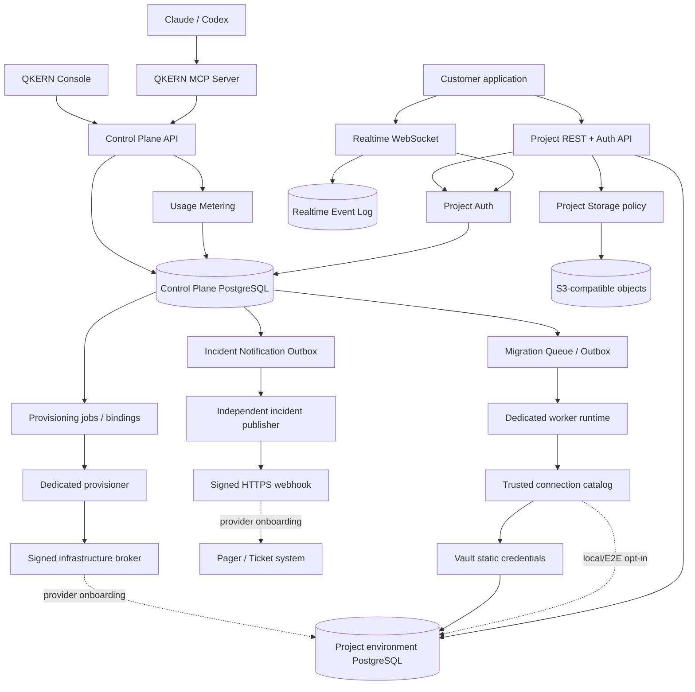
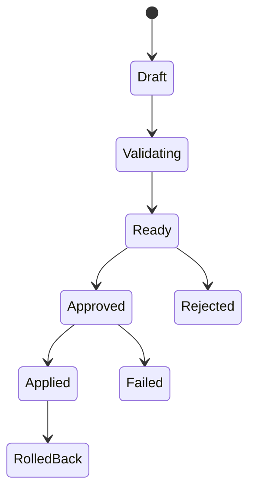
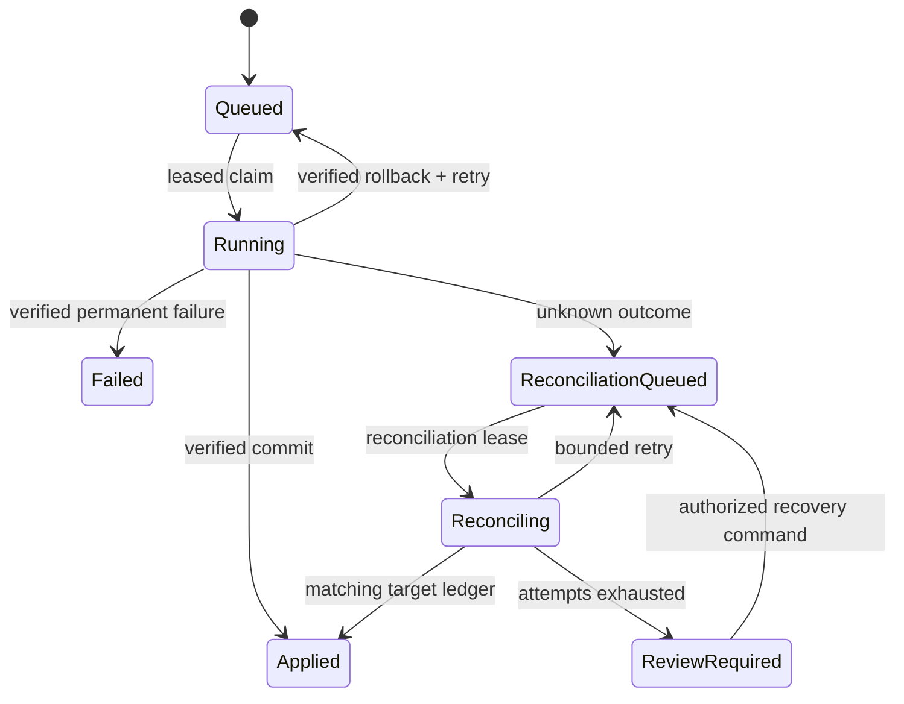
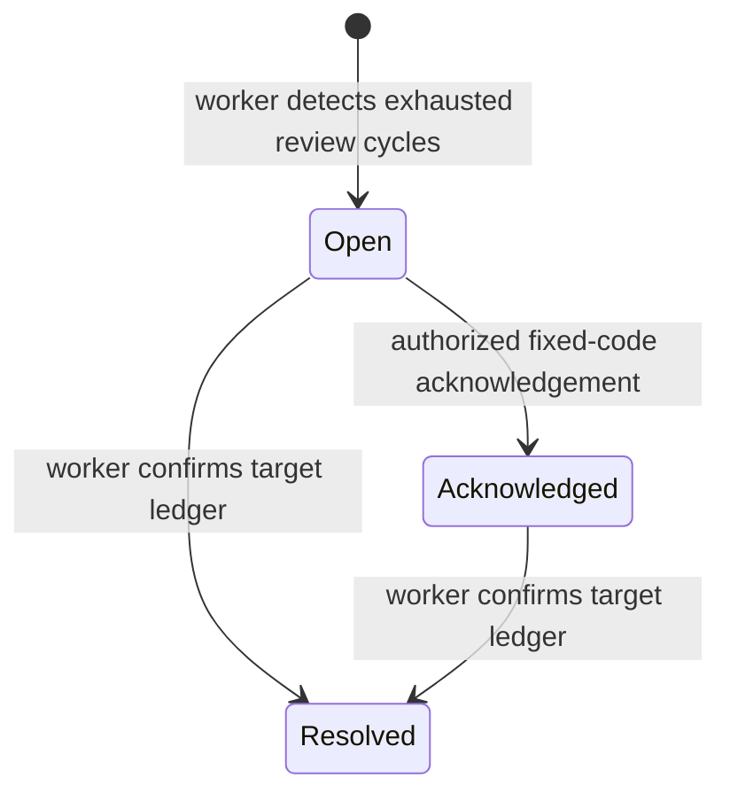

# Systemarchitektur

## Entscheidung

QKERN trennt die Control Plane von Kundendaten. Die Control Plane kennt Accounts, Organisationen, Projekte, Usage Policies, Agent-Sessions, Change Sets, Freigaben und Audit Events. Jede Projektumgebung erhält eine eigene Datenbank-Vertrauensgrenze; die Control Plane speichert nur eine opaque Instanzreferenz und keine Kunden-Credentials im Browser.

Provisioning- und Worker-Loops, `PostgresProjectDatabaseExecutor` und Runtime-Komposition sind verdrahtet. Der Webprozess darf nur einen actor-gebundenen, idempotenten Job anfordern. Ein vierter, überschneidungsfrei geprüfter Datenbank-Login claimt diesen Job mit Lease-Token, sendet ausschließlich Tenant-/Projekt-/Environment-Referenzen und den festen Bootstrap-Hash an einen signierten externen Broker und bindet dessen geprüftes secret-freies Ergebnis atomar an eine noch pendente Umgebung. Derselbe Prozess schreibt vor jedem Claim einen persistenten, per RLS an Tenant und eigene Provisioner-ID gebundenen Heartbeat. Eine schmale aggregate Datenbankfunktion liefert der Runtime Queue-, Fehler- und Liveness-SLOs ohne direkte Tabellen- oder Identitätssicht. Production lädt die unveränderlichen Bindings tenantgebunden aus der Control Plane und ruft rotierende HashiCorp-Vault-Static-Credentials ab. 1.1 ergänzt eine separat aktivierbare Lese-Data-Plane, 1.2 schema-gebundenes CRUD, 1.3 getrennte Project-Auth-App-User samt RLS-Claims, 1.4 einen getrennten Storage-Policy-/Metadata-Kern und 1.5 Alpha 1 einen getrennt startbaren Realtime-WebSocket-Kern. Provider-Onboarding, reale Mail-/OIDC-Zustellung, realer S3-/Scanner-E2E, persistenter Realtime-CDC/Fan-out und Real-Vault-/PostgreSQL-E2E fehlen weiterhin; eine Managed-Production-Freigabe ist deshalb noch nicht behauptet.

## Drei Schnittstellen

| Schnittstelle | Consumer | Credential | Erlaubter Umfang |
| --- | --- | --- | --- |
| Application API | Web/Mobile/SaaS | Projekt-Key + optionales App-JWT | Daten gemäss RLS und API-Policy |
| MCP Agent Interface | Claude, Codex, Cursor | Lokal kurzlebiges Bearer-Token; remote künftig OAuth | Kleine Tools, feste Scopes, Approval Gates |
| Model Provider API | Optionaler QKERN AI Workspace | BYO Provider Key im Vault | Nur explizit freigegebener, redigierter Kontext |

Keys sind nicht untereinander austauschbar. QKERN muss Issuer, Audience, Organisation, Projekt, Umgebung, Session, Scopes, TTL und Widerruf serverseitig validieren.

## Tenant-Topologie

- Control Plane: Shared PostgreSQL mit `organization_id` in allen tenantbezogenen Tabellen, zusammengesetzten Indizes und RLS als zweite Barriere.
- Data Plane: Datenbank pro Projektumgebung als MVP-Ziel. Development, Staging und Production teilen keine Credentials.
- Storage: Namespace und KMS-Key-Referenz pro Projektumgebung.
- Logs/Backups: Tenant-Key auf jedem Datensatz und jeder Objekt-Referenz. Keine globale Suche ohne Support-Consent und Audit.
- Source of truth: PostgreSQL-Katalog der Projektumgebung. Gecachte Schema-Metadaten sind abgeleitet und werden durch Introspection reconciled.

## Project Data Plane

`ProjectDataPlaneService` löst eine Projektumgebung nur über deren opaque
`managed:*`-Referenz auf. Production muss dafür einen eigenen Read-Role-Resolver
injizieren; ein Migration- oder Owner-Login wird an der Laufzeitgrenze abgewiesen.
Jede Operation startet `BEGIN READ ONLY`, setzt feste Statement-/Lock-/Idle-
Timeouts sowie `row_security=on` und prüft den exakten aktuellen und Session-Login,
Datenbanknamen, Loginfähigkeit und fehlende Superuser-/BYPASSRLS-/Create-/
Replication-/Membership-Attribute. Schemaabfragen sind feste `pg_catalog`-SQL;
Nutzerabfragen müssen genau ein AST-validiertes `SELECT` sein und werden serverseitig
auf 100 Zeilen und 256 KiB begrenzt. Sensible Spaltenwerte werden redigiert.

REST und MCP teilen diese Grenze. Der Dienst ist standardmäßig deaktiviert und
liefert keine Verbindung, Rollenursache oder SQL-Treiberdetails nach außen.

## Generated Data API

`GeneratedDataApiService` verwendet denselben opaque Target-Resolver, aber einen
separaten Connection-Resolver für einen unprivilegierten Projekt-API-Login. Der
Login darf kein Owner, Superuser, `BYPASSRLS`-Träger oder Mitglied einer anderen
Rolle sein. Read-Operationen starten `BEGIN READ ONLY`, Mutationen eine normale
Transaktion; beide setzen feste Timeouts, `row_security=on` und ausschließlich
serverseitig abgeleitete `request.jwt.claim.*`-Werte.

Vor jeder Operation liest der Dienst Relation, Spalten, Tabellen-/Spaltenrechte,
RLS und Primärschlüssel aus `pg_catalog`. Freigegeben werden nur normale oder
partitionierte Tabellen mit RLS. Listen unterstützen eine kleine parametrisierte
Filtergrammatik, deterministische Sortierung und einen tabellen-/sortiergebundenen
Cursor. Insert ist auf 25 Zeilen begrenzt; Update/Delete benötigen genau den
vollständigen Primärschlüssel. Sensitive-Name-Spalten sind auf allen Pfaden
gesperrt. Das dynamische OpenAPI-Dokument und der Console Table Editor verwenden
denselben Port.

`project_api_keys` speichert nur Key-Verifier, Prefix, Tenant-/Projekt-/Environment-
Scope, Art, Ablauf und monotone Revocation. Eine schmale Auth-Funktion löst einen
Verifier vor Tenant-Discovery auf; Key-Verwaltung bleibt in tenantgebundenen
Control-Plane-Transaktionen. Raw-Key-Material wird nur einmal nach Erzeugung
ausgegeben. `public` und `service` unterscheiden Claims, nicht Datenbankprivilegien;
beide bleiben RLS-pflichtig.

## Project Auth

Project Auth ist ein eigener Anwendungsnutzer-Bereich unter Organisation, Projekt
und Environment. Er verwendet nicht die QKERN-Account-/Membership-Identität. Die
Control-Plane-Migration `0024_project_auth.sql` speichert App-User, Sessions,
Einmal-Tokens, MFA-Faktoren und OIDC-Identitäten in eigenen Tabellen mit erzwungener
Scope-Bindung und eigener Least-Privilege-Grant-Grenze.

Access Tokens sind kurzlebige Ed25519-JWTs mit exaktem Issuer, Audience, Projekt,
Environment, User, Session und Assurance Level. JWKS veröffentlicht nur aktuelle
und höchstens fünf überlappende öffentliche Schlüssel. Die Prüfung lädt zusätzlich
die aktive Session und den aktiven User; Logout oder Admin-Sperrung wirken deshalb
sofort. Opaque Refresh Tokens werden nur als Verifier gespeichert und bei jedem
Gebrauch atomar ersetzt. Ein Replay markiert die ganze Familie als kompromittiert
und widerruft sie.

E-Mail-Verifikation, Magic Link und Passwort-Reset nutzen einmalige verifier-only
Tokens mit kurzer TTL und enumeration-safe Anforderung. TOTP-Secrets und OIDC-
Flow-State sind AES-256-GCM-verschlüsselt; Recovery Codes werden nur als einmalige
HMAC-Verifier gehalten. Der OIDC-Code-Flow erzwingt PKCE, State, Nonce, exakte
serverseitige HTTPS-Endpunkte, deaktivierte Redirects, begrenzte Antworten und
Issuer-/Audience-/Nonce-/Signaturprüfung.

Für die Generated Data API muss ein App-JWT zusammen mit dem exakt passenden
Projekt-Key vorliegen. Nur der verifizierte serverseitige Principal wird als
transaktionslokaler PostgreSQL-RLS-Claim gesetzt; freie Claim-Header existieren
nicht. Das Modul ist disabled-by-default. Production benötigt eine reale injizierte
Delivery-Grenze und kann Debug-Token technisch nicht aktivieren.

## Project Storage

Project Storage trennt Policy-/Metadata-Autorität vom Object Provider. Migration
`0025_project_storage.sql` persistiert Bucket, Upload und Object unter dem exakten
Organisation-/Projekt-/Environment-Scope, erzwingt RLS und macht Identitäten,
Provider-Key, Declared Size/MIME/Checksum sowie Completion-Verifier unveränderlich.
Die Runtime erhält nur schmale Tabellen- und Spaltenrechte.

Ein Upload reserviert Quota unter Bucket-Lock, speichert nur den SHA-256-Verifier
des einmal ausgegebenen Completion Tokens und erhält einen kurzlebigen S3-SigV4-
POST. Die Policy bindet Provider-Key, MIME und SHA-256 und begrenzt die gesamte
Multipart-Anfrage. Vor Commit prüft QKERN Provider-HEAD auf exakt deklarierte
Object-Bytezahl, MIME und Checksum. Ein Mismatch löscht das Provider-Object und gibt
die Reservierung frei.

Die PostgreSQL-Transitionen verwenden eine feste Sperrordnung: Upload vor Bucket
bei Completion/Cancel, Object vor Bucket bei Status/Delete. Quota-Reservationen
werden unter dem Bucket-Lock serialisiert. Concurrent Completion-Replays liefern
das bereits gebundene Object zurück, ohne Usage erneut zu erhöhen. Läuft der Grant
während Provider-HEAD oder Scan ab und gewinnt die Expiry-Bereinigung, verweigert
der gefencte Commit die Metadaten und der Service entfernt das nicht referenzierte
Provider-Object. Delete und Lifecycle dürfen denselben Provider-Delete versuchen,
reduzieren Usage wegen des monotonen `deleted_at` aber nur einmal.

Objects beginnen `quarantined`. Nur der injizierte Scanner-Port kann `clean` oder
`infected` liefern; Requests tragen nie ein Urteil. Signierte GETs existieren nur
für `clean`, maximal 900 Sekunden. `infected`, Delete und Retention/Lifecycle
löschen zuerst beim Provider und geben danach Usage frei. Production verlangt
injizierte rotierende Provider-Credentials und einen Malware-Scanner; rohe S3-
Environment-Credentials sind nur ein lokaler Development-Pfad.

Der Development-/CI-ClamAV-Adapter erzeugt dafür einen internen, kurzlebigen
Provider-GET mit Sicherheitsmarge über der 30-Sekunden-Untergrenze, verbietet
Redirects und Content-Encoding und streamt das
Object mit begrenzten Frames über das clamd-`INSTREAM`-Protokoll. Ein Urteil wird
nur übernommen, wenn beobachtete Bytezahl, normalisiertes MIME und neu berechnete
SHA-256 exakt zu den committed Upload-Metadaten passen. Netzwerkfehler, Timeout,
Größenüberschreitung, Checksum-Drift und unbekannte clamd-Antworten liefern
`pending`. Der separate portlose Docker-Zertifizierungsstack erzeugt einen
Wegwerf-MinIO-Bucket, prüft Clean-/EICAR-Pfade und entfernt Container und Volumes.
Er ist ein reproduzierbarer Nachweisweg, aber erst sein erfolgreich archivierter
Lauf in einer Docker-fähigen Umgebung erfüllt das externe Austrittsgate.

## Realtime Foundation

Der Realtime-Kern trennt `RealtimeAuthenticator`, Channel-Authorization,
`RealtimeEventLog`, Fachservice, Gateway-State-Machine und WebSocket-Transport.
Der erste Frame enthält den Project Key und optional ein Project-Auth-Access-Token;
der Server leitet daraus den vollständigen Scope und Principal ab. URL-Credentials,
freie Claims, nicht erlaubte Origins und Query-Strings werden abgewiesen.

`RealtimeService` serialisiert Subscribe/Replay und Broadcast pro Scope/Channel.
Jeder gespeicherte Broadcast erhält eine monotone Sequenz und einen HMAC-signierten,
an Organisation, Projekt, Environment und Channel gebundenen Cursor. Ein Subscribe
ohne Cursor startet am aktuellen Ende; ein Catch-up liefert spätere Events vor
neuen Live-Events. Verlorene oder zu große History wird als Stale-Cursor abgewiesen,
damit kein Ereignis still übersprungen wird. Presence verwendet private HMAC-
Schlüssel und gibt keine User- oder Connection-ID aus.

Alpha 1 verwendet einen begrenzten In-Memory-Event-Log und einen loopbackgebundenen
Standalone-Host. `NODE_ENV=production` wird technisch verweigert. Die Ports sind
für PostgreSQL-Event-Log/CDC und horizontalen Fan-out vorbereitet, diese Adapter
und ihre Multi-Instance-/Lasttests sind aber noch nicht implementiert.

## Automation Policies

`project_automation_policies` bindet Modus, Risikogrenze, Auto-Queue, Not-Aus,
Revision und ändernden User an Organisation, Projekt und Environment. Owner und
Administratoren setzen die stehende Autorisierung; Agents können sie nicht ändern.
Bei automatischer Genehmigung wird kein Approval übersprungen: QKERN erzeugt im
selben Tenant-Transaction-Flow den Request, eine system-attribuierte immutable
Decision und Audit Events. `guarded` besitzt eine kleine DDL-Allowlist und gilt
nicht für Production. `autonomous` respektiert die explizite Risikogrenze.
Production-Queueing behält die unabhängige, maschinell signierte Release-Autorität.

## Change Set State Machine

Eine Approval bindet sich an Change-Set-ID, Statement-Hash, Projekt, Umgebung, unveränderliche Datenbank-Instanzreferenz, Requester, Risiko, Scope und Ablaufzeit. Ändert sich ein gebundenes Feld, ist eine neue Approval nötig. Vor 0.4 erzeugte, noch zielungebundene Approval-Hashes stimmen nicht mehr überein und können nicht zur Apply-Queue angemeldet werden. „Approve once“ ist genau einmal konsumierbar.

## Apply Queue und Worker-Grenze

Nach einer erfolgreichen Approval wird Apply separat und ausdrücklich über `POST /api/v1/changesets/{changeSetId}/apply` oder das lokale MCP-Queue-Tool angefordert. Der API-/MCP-Request führt kein SQL aus. Im PostgreSQL-Modus prüft die Enqueue-Transaktion Tenant, Projektumgebung, nicht-pendente Instanzreferenz, Change-Set-Status, Approval-Ablauf und Action Hash. Sie erzeugt genau einen `migration_jobs`-Datensatz, genau ein referenzbasiertes `migration_outbox`-Event und einen Audit-Eintrag. Transaktions-Lock und Unique Constraints machen Wiederholungen idempotent; SQL-Ciphertext und Datenbank-Credentials gelangen nicht in die Queue oder Outbox.

Für `production` liegt davor seit v0.30 eine zweite serverseitige Release-Grenze. Der gemeinsame Apply-Service für REST und MCP verlangt eine frische Ed25519-Autorisierung, die exakt Organisation, Projekt, Change Set, Approval, SHA-256 der opaque Zielreferenz, Statement-/Action-Hash und fünf unabhängig konfigurierte Release-Evidenz-Pins bindet. Derselbe Verifier läuft mit dem unveränderlichen Claim erneut unmittelbar vor `executor.execute()`. Das Enable-Flag allein genügt nicht, die Autorisierung gilt höchstens vier Stunden, und Memory Mode kann Production nie freigeben. Fehlen Signatur, Pins, exakte Subject-Bindung oder eine der festen externen Assertions, wird vor Queue beziehungsweise SQL mit `PRODUCTION_APPLY_BLOCKED` geschlossen. QKERN besitzt keinen privaten Release-Key und erzeugt keinen positiven Nachweis.

Queue und Outbox sind mit `organization_id`, erzwungener RLS und zusammengesetzten Tenant-FKs gebunden. Worker- und Publisher-Claims verwenden `FOR UPDATE SKIP LOCKED`. Jeder Worker-Claim erhöht zusätzlich die monotone `claim_sequence`; diese vom Retry-Zähler getrennte Generation wird als Target-Fence-Epoche verwendet. Abschluss, Fehler, Lease-Erneuerung und Outbox-Publish werden durch Job-/Event-ID, Owner, zufälliges Lease-Token und eine noch gültige Ablaufzeit gefenced; abgelaufene Claims können kontrolliert übernommen werden.

Die Control Plane trennt jetzt auch die Datenbankrollen: `qkern_runtime` darf Jobs und Outbox-Ereignisse enqueueen und lesen sowie eng typisierte Review-Commands einfügen, aber keine Queue-/Outbox-Zustände schreiben. Nur der separate Non-Login-Grant `qkern_worker`, lokal über `qkern_worker_app` genutzt, erhält die begrenzten Spaltenrechte für Claims, gefencte Übergänge, Review-Command-Verarbeitung, Change-Set-Abschluss und append-only Audit. Die Pool-Grenze weist privilegierte Attribute, gefährliche Mitgliedschaften sowie Überschneidungen mit Auth- oder Web-Runtime bereits beim Start ab.

Die Worker-Domäne entschlüsselt und verifiziert unmittelbar vor dem Executor-Aufruf die vollständige Tenant-/Projekt-/Environment-Bindung, gültige Approval und Action Hash, Lease und Attempt-Grenzen, opaque Datenbankreferenz, genau ein zulässiges SQL-Statement sowie dessen SHA-256. Jeder Job bindet über `approval_request_id` exakt die Approval, die beim Enqueue autorisiert hat; ein späterer Request für dasselbe Change Set kann sie nicht ersetzen. Ein automatischer SQL-Retry ist nur erlaubt, wenn ein Executor-Fehler ausdrücklich `outcome: "rolled_back"` und `retryable: true` meldet und Versuche verbleiben.

Ein unbekanntes Ausführungsergebnis wird dagegen per gefenctem Queue-Update dauerhaft als `reconciliation_required` gespeichert. Solche Claims erhöhen einen eigenen, auf drei begrenzten Reconciliation-Zähler, lesen ausschließlich das Target-Ledger und rufen `execute()` auch bei fehlendem Ledger niemals auf. Ein passender Ledger-Eintrag schließt den Control-Plane-Job als applied; ein weiterhin fehlender Eintrag wird mit Backoff erneut eingeplant. Nach Ausschöpfung der Reconciliation-Versuche – einschließlich abgelaufener Leases nach einem Worker-Crash – wechselt der Job mit Audit-Eintrag in `review_required`, während das Change Set unverändert approved bleibt. Nur wenn bereits das Persistieren dieses Sicherheitsübergangs scheitert, bleibt `completion_deferred` als Lease-Expiry-Fallback. Ein normaler, nach Crash zurückeroberter Ausführungsclaim reconciliiert weiterhin zuerst; nur er darf bei fehlendem Ledger und weiterhin gültigem, vollständig verifiziertem Artefakt in den gefencten Ausführungspfad zurückkehren.

Owner und Administratoren können `review_required`-Jobs über `GET /api/v1/migrations/reviews` einsehen und mit `POST /api/v1/migrations/{jobId}/review/reconciliation` eine weitere Ledger-Prüfung anfordern. Der HTTP-Prozess speichert ausschließlich Job-ID, Actor-ID und einen festen Reason-Code in `migration_review_commands`; er besitzt weiterhin kein UPDATE-Recht auf `migration_jobs`. Erst der Worker sperrt und validiert das Command, setzt einen zulässigen Job atomar auf `reconciliation_required`, setzt dessen Reconciliation-Zähler zurück und erhöht den auf drei begrenzten Review-Zähler. Dieser Pfad kann weder SQL ausführen noch einen Job manuell als applied oder failed markieren; alle Anforderung-, Annahme- und Ablehnungsübergänge werden redigiert auditiert.

Nach dem dritten ausgeschöpften Review-Zyklus leitet der Worker aus dem weiterhin `review_required` gebliebenen Job genau einen `migration_incidents`-Datensatz ab. Dieser enthält nur Tenant-, Job-, Projekt- und Change-Set-Referenzen, feste Typ-/Severity-Werte und die begrenzten Zählerstände. Owner und Administratoren können den Fall über `POST /api/v1/migrations/incidents/{incidentId}/acknowledgement` einmalig mit einem festen Code quittieren; Support besitzt ausschließlich Lesezugriff über `GET /api/v1/migrations/incidents`. Die Quittierung verändert weder den Job noch das Change Set und bedeutet ausdrücklich keine technische Auflösung.

v0.18 ergänzt einen separaten Resolution-Zustandsautomaten. `POST /api/v1/migrations/incidents/{incidentId}/resolution/verification` persistiert nur ein actor- und tenantgebundenes Command mit dem festen Grund `target_ledger_recheck`; die Route greift weder auf das Ledger zu noch führt sie SQL aus. Der Worker konsumiert höchstens drei solche Commands und setzt den gebundenen `review_required`-Job ausschließlich als `reconciliation_required` zurück in die Queue. Der bestehende Reconciliation-Pfad prüft Change-Set-ID und Statement-Hash im Target-Ledger und ruft niemals `execute()` auf. Nur ein `already_applied`-Ergebnis setzt Job und Change Set auf `applied` und danach den Incident in derselben Control-Plane-Transaktion mit `target_ledger_match` auf `resolved`. Der Datenbank-Guard verlangt Worker-Rollenmitgliedschaft und den bereits angewendeten Job. Leere oder unklare Evidenz kehrt nach der begrenzten Prüfung zu `review_required` zurück. Resolution- und Delivery-Recovery-Trigger sperren vorhandene Commands vor Job beziehungsweise Outbox und entsprechen damit der Worker-Sperrreihenfolge.

In derselben Worker-Transaktion entsteht genau ein `migration_incident_outbox`-Event. Die Outbox speichert nur die Incident-Referenz; der gefencte Claim hydratisiert den festen Zustellvertrag aus der unveränderlichen Incident-Evidenz. `MigrationIncidentOutboxPublisher` ist unabhängig von Migration Worker und Apply-Outbox-Publisher aktivierbar, arbeitet seriell at-least-once und verlangt ein Ack mit exakt derselben Event-ID. Publish, Failure-Übergang und Backoff benötigen Publisher-ID, Lease-Token und ein noch gültiges Lease. Nach acht bestätigten Fehlern wechselt das Event atomar nach `dead_lettered`; Prozessabbruch und Lease-Verlust erhöhen den Failure-Zähler nicht. Die Web-Runtime besitzt keinerlei Rechte auf die Outbox. Sie darf lediglich ein actor-gebundenes, fest typisiertes Delivery-Recovery-Command für einen dead-lettered Incident einfügen. Seit 0.17 enthält dieses Command den vom Operator gelesenen Fehlercode. Migration `0016_migration_incident_delivery_recovery_binding.sql` vergleicht ihn im `SECURITY DEFINER`-Trigger atomar mit dem aktuellen Outbox-Snapshot und erzwingt die feste Code-/Reason-Kompatibilität. Migration `0018_migration_incident_delivery_recovery_generation.sql` ergänzt die gelesene `retry_cycle_count` als `expectedRetryCycle`. Nur der Publisher-Worker konsumiert ein exakt passendes Command; unmittelbar vor dem Update bindet seine Query Code und Generation erneut. Ein geänderter Fehlerzustand oder derselbe Code in einer späteren Generation kann damit keinen veralteten Retry öffnen. Exakte Wiederholungen von Grund, Code und Generation sind idempotent, abweichende Commands fail-closed. Dieser Pfad verändert weder Incident/Job noch SQL. 0.17 umfasst außerdem den ausführbaren Host `publisher:incidents` und `SignedIncidentWebhookSink`: Der Adapter löst pro Zustellung ein validiertes Key-ID/Secret-Paar über `IncidentWebhookSigningKeyProvider` auf, signiert den unveränderten JSON-Body mit HMAC-SHA-256, sendet nur an einen exakt erlaubten Endpoint, verbietet Redirects und begrenzt Key-Auflösung, Transport sowie Ack-Größe. Seine sicheren Fehler werden über `MigrationIncidentOutboxSinkError` als feste Persistenzcodes klassifiziert; unbekannte Sink-Fehler bleiben `PUBLISH_FAILED`. Provider-Onboarding, konkrete Vault-Anbindung und echte Netzwerkzustellung sind weiterhin Deployment-Gates.

Operative Sichtbarkeit durchbricht diese Rollengrenze nicht. v0.13 führte die reine Tenant-Aggregation mit fester Fünf-Minuten-SLO ein; v0.14 ergänzt migrationssicher die Detailprojektion. v0.16 erweitert die Fehler-Allowlist und Health-Funktion additiv um aktive, disjunkte Ursachen-Counts. `qkern_runtime` erhält weiterhin kein `SELECT` auf Outbox oder Delivery-Commands, sondern nur `EXECUTE` auf zwei enge `SECURITY DEFINER`-Funktionen. Die erste akzeptiert höchstens 100 bereits autorisierte Incident-IDs und projiziert Event-ID, festen Zustand/Fehlercode, Zähler und Zeitpunkte. Die zweite aggregiert denselben Tenant in disjunkte Pending-/Ready-/Scheduled-/In-flight-/Published-/Dead-lettered-Counts, Overdue-/Expired-Lease-/Recovery-Kennzahlen und aktive Fehlerursachen. API und Service prüfen Status- und Ursachen-Summen fail-closed; publizierte Events zählen nicht als aktive Fehler. Lease-Token, Worker-/Operator-Identitäten und Providerdiagnosen besitzen keinen Ausgabeslot.

v0.24 wendet dieselbe Trennung auf Projekt-Datenbank-Provisioning an. `project_database_provisioner_heartbeats` akzeptiert per RLS ausschließlich Self-Writes des in `qkern.actor_ref` gebundenen Provisioners. Die Runtime besitzt keine Tabellenrechte und kann nur `qkern_project_database_provisioning_health()` ausführen. Diese Funktion aggregiert Zustände, disjunkte feste Fehlerursachen, über fünf Minuten pendente Jobs, abgelaufene Leases sowie aktive/stale Heartbeats in einem festen Zwei-Minuten-/24-Stunden-Fenster. Der Service verlangt exakte Zustands-, Fehler- und Provisioner-Summen. Ausgeschöpfte Recovery, abgelaufene Leases, Arbeit ohne aktiven Provisioner sowie Bindungs-/Bootstrap-Verifikationsfehler sind `critical`; Identitäten und Infrastrukturdetails werden nicht projiziert.

v0.25 stellt diese Projektion einem externen Scraper bereit, ohne Browser- oder Membership-Autorität wiederzuverwenden. Der interne OpenMetrics-Endpunkt ist standardmäßig nicht vorhanden, verlangt PostgreSQL-Modus und bindet sich serverseitig an genau eine Organisations-UUID. Ein eigener Bearer wird pro Scrape aus einer privaten No-follow-Datei gelesen und über feste SHA-256-Digests zeitkonstant verglichen; Inline-Token und die Wiederverwendung von Vault-/Broker-/Webhook-Dateien sind verboten. Cookie und `X-QKERN-Organization` werden ignoriert. Die Exposition enthält nur feste Metrikfamilien und feste `state`-/`kind`-/`code`-Labels. Reales Scraping, Alertmanager-/OTel-Routing und Deployment-Readiness bleiben außerhalb des Quellvertrags.

v0.26 fügt außerhalb der Control-Plane-Datenbank eine schmale Evidenzgrenze für Disaster-Recovery-Drills hinzu. Der Backup-/Restore-Provider und ein separater Drill-Runner erzeugen die private Detailspur; der Runner signiert daraus nur einen festen, secretfreien Contract mit einem extern verwahrten Ed25519-Key. `BackupRestoreEvidenceVerifier` liest die Evidenz und den gepinnten Public Key direkt aus integritätsgeschützten No-follow-Dateien, prüft Signatur, Zeit-/Policy-Invarianten und gleiche Source-/Restore-Manifeste und gibt ausschließlich eine begrenzte Readiness-Projektion zurück. `verify:backup-restore` macht diese Prüfung als Release-Gate ausführbar. Optional bindet die v0.25-Metrics-Grenze denselben Verifier ein und exportiert nur feste Readiness-, RPO-/RTO- und Timestamp-Metriken; sie speichert keine Evidenz und akzeptiert keine neue Browser-, Tenant- oder Schreibautorität. Backup-/Restore-Ausführung, privater Signierschlüssel, Retention und reale Drill-Archivierung bleiben externe Live-Verantwortung.

v0.27 ergänzt außerhalb der öffentlichen Control-Plane-API einen gemeinsamen lokalen Prozessstatus. Jeder der vier Hintergrund-Hosts kann einen disabled-by-default Listener ausschließlich auf `127.0.0.1` starten. Ein gemeinsamer Observer erhält nur Lifecycle- und Poll-Ergebnis-Signale, keine Job-, Tenant-, Endpoint- oder Fehlerdaten. Liveness folgt dem Prozesszustand; Readiness verlangt einen aktuellen erfolgreichen Poll und wird bei Queue-/Control-Plane-Fehler, Veraltung, Clock-Rollback oder Shutdown sofort geschlossen. Probe-Fehler werden isoliert und können keine fachlichen Zustandsübergänge beeinflussen. Die Bindung ist für In-Container-Exec-Probes bestimmt und darf keine Service-/Ingress-Grenze werden.

v0.28 ergänzt eine deterministische Deployment-Komposition für genau diese vier Hosts. Alle verwenden dasselbe digest-gepinnte Image, aber getrennte tokenlose ServiceAccounts, einzelne Container, komponentenspezifische Entrypoints und eng referenzierte ConfigMap-/Secret-Keys. Non-root, Seccomp, read-only Root-Dateisystem, entfernte Capabilities, deaktivierte Host-Namespaces, Memory-`/tmp`, Ressourcenlimits und Loopback-Exec-Probes sind Teil des exakten Vertrags. Ein no-follow File-Verifier rekonstruiert den Soll-Bundle aus vier erwarteten Parametern und akzeptiert keine Abweichung oder Zusatzressource. `tsx` ist dafür Production-Abhängigkeit. Der Bundle enthält absichtlich keine Cluster-, Netzwerk-, Registry-, Secret- oder Monitoring-Autorität; deren Live-Nachweis bleibt extern.

v0.29 schließt die Verifikationsgrenze, ohne QKERN Cluster-Zugriff zu geben. Ein getrennter Live-Certification-Runner beobachtet den tatsächlich ausgerollten, ursprünglich in v0.28 eingeführten und vom aktuellen Release generierten Bundle und signiert nur einen festen, secretfreien Ed25519-Vertrag. `RuntimeDeploymentEvidenceVerifier` bindet diesen an den kanonischen Bundle-Hash, Image-Digest, Namespace sowie serverseitig konfigurierte Cluster-, NetworkPolicy- und Image-Provenance-Pins. Alle vier Komponenten müssen exakt einmal und in fester Reihenfolge erscheinen; Rollout/Replicas, Loopback-Probes, SIGTERM-/Restart-Verhalten, Security Context, Service-Account-Token-Abwesenheit und Secret-Projektion müssen positiv bestätigt sein. Ebenso zwingend sind Default-deny/Egress, fehlende externe Selektoren/Ingress-Ressourcen, Image-Signatur/SBOM/Vulnerability-/Provenance-Policy und reales Metrics-/Alert-Routing. Der Verifier prüft Signatur, gepinnten Public Key, exakte Felder, Zeitfolge, abgeleitete Dauer und 24-Stunden-Frische und projiziert weder Evidenz-ID, Namespace, Cluster, Digests noch Key-Daten. Der private Signierschlüssel, Kubeconfig und die detaillierte Cluster-Spur bleiben außerhalb von QKERN.

v0.30 nutzt diese Live-Evidenz nicht als alleinige Apply-Autorität. Eine getrennte Release-Autorität bindet deren Digest zusammen mit Restore-, Provider-E2E-, Security- und Release-Artefakt-Digests an genau ein bereits genehmigtes Production-Change-Set. Public Key und Autorisierung kommen aus getrennten No-follow-Dateien; der Key und alle fünf Evidenzartefakte sind serverseitig separat und paarweise verschieden gepinnt. API/MCP und Worker lesen die Autorität jeweils neu. Dadurch kann weder ein kompromittierter Webpfad allein einen Production-Job erzeugen noch ein vorhandener beziehungsweise injizierter Job die Executor-Grenze erreichen. Der Signer und die realen Tests bleiben außerhalb von QKERN.

v0.31 implementiert den zuvor nur als Digest vorgesehenen Provider-E2E-Nachweisvertrag.
Ein unabhängiger Runner muss 15 feste Managed-PostgreSQL-17-Szenarien für Provisioning,
Broker-Negativpfad, Vault-Ausgabe/Rotation/Widerruf, TLS-Pin, Apply, Crash-
Reconciliation, Rollback-Retry, Stale-Worker-Cancellation, Cross-Tenant-Isolation,
beide Publisher sowie Pager- und Alert-Lifecycle real bestehen. Die signierte Evidence
bindet sieben getrennte Artefaktdigests: Provideridentität/-konfiguration,
Brokervertrag, Vault-Policy, Pager-Routing und die exakten Restore- und
Runtime-Deployment-Evidenzen. `ProviderE2EEvidenceVerifier` besitzt keine
Provider-/Vault-/Pager-Autorität, akzeptiert nur den externen Ed25519-Nachweis und
projiziert optional feste Readiness-Metriken. Der Digest dieser signierten Envelope
ist der v0.30-Provider-E2E-Pin; die Production-Apply-Grenze bleibt unabhängig.

v0.32 implementiert auch den zuvor nur als Digest vorgesehenen Security-Assessment-
Nachweis. `SecurityAssessmentEvidenceVerifier` bindet 14 feste Kontrollen, null
offene Critical-/High-Findings, Zeitpolicy und acht getrennte Release-/SBOM-/Scan-/
Pentest-Artefakte an einen dedizierten Ed25519-Key. Die optionale Metrics-Projektion
bleibt auf feste Counts, Dauer und Zeitpunkte begrenzt. `ReleaseEvidenceVerifier`
führt Restore, Deployment, Provider-E2E und Security Assessment zusammen und hasht
die fünf tatsächlich gelesenen Release-/Envelope-Dateien gegen exakt die Pins der
späteren Production-Apply-Autorisierung. Er signiert nichts und verleiht selbst
keine Apply-Autorität.

1.0 RC1 ergänzt darüber `ProductionReadinessVerifier` als reine Kompositionsgrenze.
Er akzeptiert nur die exakten Readiness-Verträge des statischen Deployment-
Verifiers und des kombinierten Release-Evidence-Verifiers sowie eine enge,
secretfreie Production-Konfiguration. Die Teilresultate werden erneut strukturell
validiert; ein dependency-injiziertes oder manipuliertes positives Objekt genügt
nicht. Die Ausgabe enthält nur feste Counts und den expliziten Zustand
`productionApplyEnabled: false`. Der Verifier besitzt keine Seiteneffekt-Schnittstelle.

Der aktuelle Background-Runtime-Bundle projiziert die beiden Production-Apply-Dateien
und sieben referenzbasierte ConfigMap-Werte ausschließlich in den Migration Worker. Die
Web-Control-Plane muss dieselbe Autorität über ihren separaten Deployment-Vertrag
erhalten. Der Live-Evidence-Verifier hasht stets den durch dieselbe Release-Version
erzeugten Bundle; ein älteres v0.29-Zertifikat kann daher den erweiterten v0.30-Bundle
nicht autorisieren.

`PostgresProjectDatabaseExecutor` setzt `statement_timeout`, `lock_timeout` und `idle_in_transaction_session_timeout` lokal in einer Ziel-Datenbanktransaktion, sperrt konkurrierende Wiederholungen über die Change-Set-ID, führt genau das vorgeprüfte Statement aus und schreibt Change-Set-ID plus SHA-256 atomar in `qkern_internal.migration_ledger`. Derselbe Change-Set-Schlüssel mit demselben Hash liefert `already_applied`, ein abweichender Hash einen Konflikt; identisches SQL in zwei getrennten Change Sets bleibt zulässig. Der Resolver bindet einen exakten erwarteten Login. Superuser-, `BYPASSRLS`-, `CREATEDB`-, `CREATEROLE`-, `REPLICATION`- und gefährliche Rollenmitgliedschaften werden abgewiesen. Das Ledger muss durch einen anderen Non-Login-Owner vorprovisioniert sein; die Migration-Rolle erhält dort ausschließlich `SELECT` und `INSERT`, kein Schema-`CREATE`, keine DDL-/Update-/Delete-/Trigger-Rechte. Bekannte Lock-/Serialization-Fehler gelten erst nach erfolgreichem Rollback als retrybar, und ein unklarer Commit verwirft die Verbindung ohne Retry.

`TrustedProjectDatabaseConnectionCatalog` ist die statische Resolver-Grenze für lokale/E2E-Adapter. `VaultProjectDatabaseConnectionCatalog` implementiert denselben Exact-Match-Vertrag für Production: opaque `managed:*`-Referenzen werden einmalig an eine Vault-Static-Role, Zielhost/-port, erwarteten Login, Datenbank, Ledger-Owner und SHA-256-Zertifikatspin gebunden. Der HashiCorp-Endpoint `/v1/<mount>/static-creds/<role>` wird nur über die vorgegebene HTTPS-Basis, ohne Redirect und mit gemeinsamer Token-/Transport-Zeitgrenze abgerufen. Vault-Benutzername und erwarteter Login müssen identisch sein. Die TTL bestimmt einen vorgezogenen Refresh; gleiches Passwort verlängert die Generation, ein neues Passwort tauscht sie atomar. Überfällige fehlgeschlagene Refreshes fallen nicht auf alte Credentials zurück. Aktive Clients halten ihre alte Generation bis `release`, danach wird sie geschlossen und das Passwort aus dem Generationsobjekt entfernt.

`MigrationWorkerRuntime` ruft seriell jeweils genau ein `runOnce` auf, wartet nur bei leerer Queue, begrenzt den Fehler-Backoff und reagiert abbrechbar auf Shutdown. Der gemeinsame Host verdrahtet diese Schleife mit `qkern_worker`, Statement-Cipher, Katalog und PostgreSQL-Executor. `worker:migrations:local` wählt außerhalb von Production den Opt-in-Raw-URL-Adapter; `worker:migrations` wählt in Production ausschließlich Vault plus privaten Token-File-Provider. Beide Pfade schließen beim Shutdown Control-Plane-Pools und alle Projekt-Pool-Generationen.

Provisioner, Migration Worker und beide Outbox-Publisher melden denselben v0.27-Probevertrag. Der erste erfolgreiche Poll schaltet Ready; ein technischer Claim-/Command-Poll-Fehler schaltet ihn unmittelbar aus. Sicher verarbeitete fachliche Job-/Delivery-Ausgänge gelten dagegen als funktionierender Poll. Dadurch bleiben lokale Prozessfähigkeit, persistente tenantgebundene Provisioner-Health, Delivery-SLOs und externe Backup-/Restore-Evidenz getrennte Signale.

Der v0.28-Deployment-Bundle exponiert diese Probe nicht über einen Container-Port, Service oder Ingress. Der Orchestrator ruft sie ausschließlich per `exec` im Container ab. IDs stammen aus `metadata.name`; Infrastrukturparameter kommen aus einer einzelnen benannten ConfigMap, Datenbank-/Statement-/HMAC-Autorität aus einzelnen Secret-Key-Referenzen und rotierbare File-Authorities aus read-only `0400`-Projektionen. Eine separate Plattformschicht muss Default-deny und schmale Egress-Regeln ergänzen, ohne den geprüften Runtime-Bundle zu verändern.

Während Zielausführung und zurückeroberter Ledger-Reconciliation erneuert der Worker sein Control-Plane-Lease per Heartbeat. Der Executor schreibt vor dem Statement eine dauerhafte, monotone Fence-Epoche in `qkern_internal.migration_fences` und prüft sie innerhalb der Statement-Transaktion erneut. Eine ältere Epoche kann eine neuere nicht überschreiben. Bei einem Reclaim ist ein automatischer Retry selbst nach bestätigtem Rollback oder nachweislich nicht begonnenem Versuch nur erlaubt, wenn genau die aktuelle höhere Fence-Epoche dauerhaft bestätigt wurde; unbekannte Fence-Ergebnisse bleiben deferred. `db/project/0002_qkern_migration_fence.sql` ist wie das Ledger ein Provisionierungsvertrag, nicht Teil der Control-Plane-Migrationen. Diese Logik ist automatisiert getestet, aber noch nicht durch die optionale Real-PostgreSQL-E2E-Suite zertifiziert.

Das Fence ist bewusst nicht präemptiv: Eine bereits gestartete Zieltransaktion wird durch einen späteren Control-Plane-Reclaim nicht abgebrochen. Der neue Worker wartet am Target-Advisory-Lock und reconciliiert nach Freigabe zuerst das Ledger. Eine widerrufbare Ausführungsberechtigung beziehungsweise kontrollierte Query-Cancellation sowie ein echter PostgreSQL-Interleavingstest bleiben Production-Gates; 0.20 behauptet keine vollständige Stale-Worker-Cancellation.

Apply- und Incident-Outbox-Publisher sind separate At-least-once-Komponenten und unabhängig vom Migration Worker sowie voneinander aktivierbar; sie benötigen weder dessen Enable-Flag noch dessen Worker-ID. Erst ein exaktes Event-ID-Acknowledgement erlaubt den gefencten Übergang nach `published`. Nachrichten enthalten nur feste Referenzfelder, kein SQL, keine Credentials und keine Rohdiagnosen. Beide Publisher besitzen startbare Hosts, HMAC-SHA-256 über `<timestamp>.<raw-body>`, versionierte und pro Zustellung neu aufgelöste Rotationsschlüssel, exakte Host-Allowlisten, Production-HTTPS/443, deaktivierte Redirects, gemeinsame Key-/Transport-Timeouts und begrenzte Acks.

Migration `0019_migration_apply_delivery_resilience.sql` erweitert die Apply-Outbox um feste Fehlercodes, acht gefencte Fehler bis `dead_lettered` sowie höchstens drei Recovery-Zyklen. Runtime-Commands binden Actor, Tenant, kompatiblen Grund, beobachteten Fehlercode und Retry-Generation in einem `SECURITY DEFINER`-Trigger; der Publisher revalidiert Code und Generation beim Verbrauch unter Command-first-Locking. Veraltete oder ABA-wiederkehrende Commands werden abgewiesen. `qkern_runtime` verliert direkte Apply-Outbox-Leserechte und erhält nur enge tenantgebundene Status-/Health-Funktionen sowie Command-Insert. Broker-/Pager-Providerverträge, Tenant-/Topic-ACLs, konkrete Vault-/KMS-Anbindung, externe Alarmierung und überwachte Deployment-Definitionen bleiben Live-Gates.

Das v0.20-Zertifizierungs-Harness kapselt die Control Plane in einem eigenen PostgreSQL-17-Cluster ohne Host-Port und mit tmpfs-Datenverzeichnis. Der Node-Runner verwendet getrennte Runtime-, Auth- und Worker-Logins, erzeugt unter einem ausdrücklichen Gate eine zufällig benannte Testdatenbank, migriert sie zuerst bis 0017 und danach separat mit 0018. Dadurch prüft er den echten Enum-/Transaktionsvertrag, Current-/Stale-Backfill, SQL-NULL-Constraints, ABA-Replay, erfolgreichen Generation-Retry, Command-first-Blocking und Worker-only-Resolution. Der Runner entfernt Stack und Volumes unabhängig vom Testergebnis. Diese Architektur stellt den reproduzierbaren Nachweisweg bereit; sie ersetzt keinen tatsächlich ausgeführten und archivierten CI-/Freigabelauf und deckt Target-Database-Crash-/Fence-Races nicht ab.

## Project Queues Alpha-Architektur

`lib/server/project-queues` trennt Fachservice und Repository-Port von HTTP, MCP
und Runtime-Komposition. Der Service leitet Queue-Scope und Principal nie aus dem
Payload ab, validiert JSON und Policies und erzeugt Roh-Lease-Tokens. Das Repository
erhält nur deren SHA-256-Verifier und serialisiert in Alpha 1 alle Zustandswechsel
pro Queue. Dadurch sind parallele Dedupe-Enqueues, Claims, Settlements, Expiry-
Recovery und Statusberechnung innerhalb eines Prozesses atomar.

Der Zustandsautomat hat nur `available`, `in_flight`, `completed` und
`dead_lettered`. Claim erhöht Attempt und `leaseSequence`; Ack, Fail und Renewal
verlangen das exakte noch gültige Worker-Lease. Fail berechnet den nächsten
Zeitpunkt serverseitig, und Lease-Ablauf wird vor dem nächsten Claim beziehungsweise
Statuszugriff gefenct recovered. Die Repository-Schnittstelle trägt eine explizite
Durability-Klasse. Der Memory-Adapter meldet `ephemeral`; die Production-Komposition
akzeptiert ausschließlich `durable` und verhindert damit eine reine Konfigurations-
Umdeklaration.

REST und MCP sind schmale Adapter. MCP darf nur Definitionen/Status lesen und
enqueueen, aber keine Worker-Leases beanspruchen. Der PostgreSQL-Adapter setzt
dieselben Service-/Conformance-Invarianten mit RLS, Transaktionen, `SKIP LOCKED`
und Restart-Persistenz um; mehrere Instanzen, Crash-Races und Last sind noch nicht
extern zertifiziert. Functions, Cron und Webhooks werden als getrennte Worker-/
Sandbox-Domänen angebunden, nicht innerhalb des Web-Request-Prozesses ausgeführt.

## Usage Metering Alpha-Architektur

`lib/server/usage` trennt Metrik-/Quota-Fachlogik, Repository-Port, HTTP und
Runtime-Komposition. Interne Emitter übergeben nur servergebundenen Tenant-Scope,
eine feste Quelle, Metrik, Menge und einen Idempotency Key. Der Service validiert
Quelle/Metrik, Zeitfenster und Rollen, hasht den Key und berechnet ein UTC-
Monatsfenster. Browser und MCP besitzen keinen Ingestion-Port.

Der PostgreSQL-Adapter wertet Idempotenz, aktuelle Policy und Counter innerhalb
einer tenantgebundenen Transaktion aus. Advisory-/Zeilensperren serialisieren Key
und Monatscounter. `enforce` lehnt eine Überbuchung ab, `observe` schreibt sie; in
beiden Fällen entsteht eine unveränderliche Entscheidung. Migration 0028 bindet
Policy, Counter und Event über RLS und zusammengesetzte Tenant-FKs. Die Console
liest ausschließlich eine redigierte Monatsprojektion. Produkt-Emitter, Tarife und
Billing bleiben getrennte Folgeadapter und dürfen nicht in den Browser wandern.

## Laufzeitadapter und nächste Produktionsgrenzen

Der lokale `lib/server/store.ts` ist ausschließlich der Memory-Adapter für Demonstration und Tests. Mit `QKERN_RUNTIME_MODE=postgres` verwenden Auth, Sessions, Memberships, Console, Change Sets, Approvals und MCP-Projekt-/Log-/Preview-Operationen die PostgreSQL-Servicegrenze. Production verweigert Memory-Modus und prüft getrennte Auth-/Runtime-Loginrollen vor der ersten Query.

Für eine vollständige BaaS-Produktion fehlen weiterhin:

1. Redis-basiertes verteiltes Rate Limiting und Session-Bereinigung.
2. Live-Anbindung und Zertifizierung des implementierten Provisioner-Brokers gegen den gewählten Provider einschließlich Vault-Policy, Agent-Sink, Credential-Rotation, Zertifikatwechsel, Bootstrap-Attestierung und Target-Cluster; Provider-Credentials dürfen QKERN nicht erreichen.
3. Den v0.28-Background-Runtime-Basisvertrag mit Namespace-/Egress-NetworkPolicies, signierter Registry-Provenance, realer Secret-Projektion und SLO-Alarmierung live zertifizieren; Broker-/Pager-Onboarding mit Tenant-/Topic-ACLs sowie echte E2E-Zertifizierung beider signierter Delivery-Pfade einschließlich Dead-Letter-/Recovery-Races; zusätzlich Real-PostgreSQL-/Worker-E2E einschließlich Resolution-, Heartbeat- und Target-Fence-Races sowie verwaltete Data-/Generated-API-Rollen gegen die reale Provider-Infrastruktur.
4. S3-kompatibler Storage mit KMS, MIME-Sniffing, Malware-Scan und signierten URLs.
5. OAuth/OIDC-Resource-Server für Remote MCP; statisches HTTP-Bearer ist in Production deaktiviert.
6. OTel-Metriken, Alerting, Restore-Übungen und definierte SLO/RPO/RTO.
