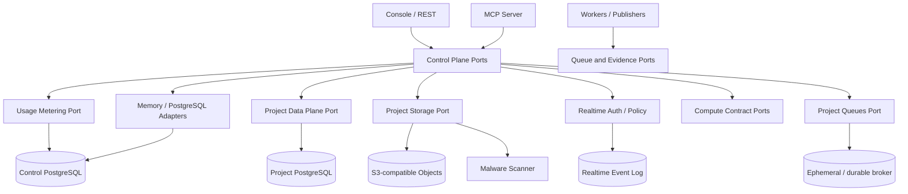

# QKERN Modularchitektur

QKERN ist modular aufgebaut: aktuell als **modularer Monolith** für Web und Control
Plane, mit separat startbaren Prozessen für MCP, Provisioning, Migration Worker und
Publisher. Das hält lokale Entwicklung einfach, ohne die Sicherheitsdomänen oder
spätere Service-Extraktion zu vermischen.

## Module und Eigentümerschaft

| Modul | Pfad | Verantwortet | Darf nicht |
| --- | --- | --- | --- |
| UI/API | `app/`, `components/` | HTTP, Console, Input-Schemas | Tenant/Actor aus Client-Behauptungen ableiten |
| Auth/Tenancy | `lib/server/auth`, `tenancy*` | Accounts, Sessions, Memberships, Capabilities | Projekt-App-User mit Control-Plane-Usern vermischen |
| Project Auth | `lib/server/project-auth` | App-User, E-Mail-/OIDC-Identitäten, JWT/JWKS, Refresh, MFA und Admin-Port | QKERN-Membership ableiten, rohe Tokens speichern oder RLS umgehen |
| Control Plane | `lib/server/control-plane` | Projekte, Change Sets, Approvals, Policies, Audit | rohe Projekt-Credentials ausgeben |
| Data Plane | `lib/server/data-plane` | Schema, begrenzte Reads, RLS-gebundenes Tabellen-CRUD und der GraphQL-Ausschnitt darüber, lesend und mit Mutationen über denselben Schreibweg in einer Transaktion | beliebiges SQL, Tabellenowner oder privilegierte Rollen akzeptieren, einen zweiten Schreibweg neben der Data API bauen, Ändern oder Löschen ohne Bedingung, unbegrenzte Tiefe/Feldzahl zulassen oder Aliasse an den Grenzen vorbeilassen |
| Project API Keys | `lib/server/project-api-keys` | Key-Erzeugung, Verifier, Ablauf, Scope und Widerruf | rohe Keys persistieren oder RLS umgehen |
| Project Storage | `lib/server/project-storage` | Bucket-/Object-Policies, serialisierte Quota-/Completion-Übergänge, signed Grants, Provider-/Scanner-Ports, ClamAV-Streaming, Quarantäne und Lifecycle | rohe Completion Tokens oder Provider-Credentials speichern, ClamAV öffentlich exponieren, Expiry-/Commit-Fencing umgehen, Quarantäne umgehen oder Public-Write erlauben |
| Realtime | `lib/server/realtime`, `workers/realtime-runtime.mts` | WebSocket-Protokoll, Auth-Bindung, Channel-Policy, Ordering, Replay-Cursor, Broadcast, Presence und Backpressure | Client-Tenant/Claims vertrauen, URL-Credentials zulassen, Replay-Lücken verschweigen oder Alpha-1-Memory-State als Production-Persistenz darstellen |
| Project Queues | `lib/server/project-queues` | Queue-Policies, Memory-/PostgreSQL-Ports, Claims/Fencing, injizierbarer Worker, DLQ-Replay und redigierter Status/Telemetrie | Roh-Secrets/Payloads loggen, Worker-/DLQ-Autorität über MCP ausgeben, Client-Retryzeiten vertrauen oder Memory als durable deklarieren |
| Compute Contracts | `lib/server/compute` | Function-Sandbox-Referenzen, Cron→Queue-Dedupe, Webhook-Signer/Transport, Zustellprozess und bounded Responses | fremden Code im Webprozess ausführen, Secret-Werte transportieren, freie Egress-Ziele oder Redirects erlauben, ohne Signaturschlüssel zustellen |
| Usage Metering | `lib/server/usage` | feste Metriken, verifier-only Idempotenz, Monatscounter, Quota-Entscheidungen, Policies und read-only Projektion | Browser-/MCP-Events annehmen, Preise/Rechnungen ableiten, Rohschlüssel speichern oder Tenantgrenzen umgehen |
| TypeScript SDK | `sdk/typescript` | Typed REST-Clients, Fetch-Port, URL-/Credential-/Timeout-/Fehlergrenze und ESM/DTS-Distribution | Secrets persistieren/loggen, Writes automatisch wiederholen, Serverfehler reflektieren oder ungeprüft publizieren |
| CLI | `cli` | secretfreie Projektkonfiguration, Type-Generator, lokale Migration-/Seed-Validierung und eigenständiger ESM-Build | Konfigurationsdateien überschreiben, Secrets speichern, Pfadgrenze verlassen, SQL implizit ausführen oder Servermodule importieren |
| DB Repositories | `lib/server/db` | tenantgebundene Persistenz und RLS-Transaktionen | HTTP- oder UI-Belange kennen |
| Migrations | `lib/server/migrations`, `workers/` | Queue, Apply, Ledger, Fence, Recovery | SQL im Web-Request ausführen |
| Provisioning | `lib/server/provisioning`, `workers/` | opaque Bindings und Brokervertrag | Provider-Credentials in QKERN speichern |
| MCP | `mcp/` | kleine projektgebundene Agentenwerkzeuge | Policy, Tenant oder Secret Boundary umgehen |
| Operations | `lib/server/operations`, Runbooks | Evidenz, Readiness und Deployment-Verträge | selbst externe Evidenz signieren |

## Abhängigkeitsregeln

1. `app/` ruft Service-Ports auf, keine SQL-Queries.
2. Fachservices kennen Interfaces und Records, nicht HTTP-Requests.
3. PostgreSQL- und Memory-Adapter implementieren dieselben Control-Plane-Ports.
4. Freies Projekt-SQL läuft ausschließlich über den Read-only-`ProjectDataPlanePort`;
   Tabellen-CRUD ausschließlich über `GeneratedDataApiPort` und dessen Live-Schema-
   und RLS-Prüfung.
5. Worker erhalten eigene Datenbankrollen und führen keinen Browser-Session-Code aus.
6. Secrets werden nur an der kleinsten notwendigen Adaptergrenze aufgelöst.
7. Production-Apply- und Evidence-Verifier bleiben unabhängige Autoritäten.
8. Projekt-Key-Authentisierung entdeckt den Tenant nur über eine schmale Auth-
   Funktion; Verwaltung bleibt tenantgebunden in der Control Plane.
9. Project Auth besitzt einen eigenen User-/Session-Namespace. App-JWTs werden nur
   zusammen mit einem passenden Projekt-Key zur Generated Data API zugelassen;
   Client-Claims werden nie direkt in PostgreSQL übernommen.
10. Der Scanner liest nur über einen intern erzeugten kurzlebigen Provider-Grant,
    folgt keinen Redirects und darf ohne exakten Byte-/MIME-/Checksum-Match kein
    `clean`-Urteil an den Service zurückgeben.
11. Storage-Reservation, Completion, Cancel und Object-Delete verschieben Quota
    atomar unter Zeilensperren; ein verlorenes Expiry-/Commit-Race muss Provider-
    Daten bereinigen und darf Usage weder doppelt erhöhen noch doppelt freigeben.
12. Realtime authentifiziert im ersten Frame, bindet jede Connection serverseitig
    an den vollständigen Scope und serialisiert Replay plus Live-Broadcast pro
    Channel. Transport, Policy und Event Log bleiben austauschbare Ports.
13. Ein Realtime-Cursor ist HMAC-signiert und Scope-/Channel-gebunden. Unvollständige
    History führt zu Full-Resync, niemals zu einem scheinbar aktuellen Cursor.
14. Project Queues bindet jede Definition, Nachricht und Operation an den vollständigen
    Scope. Nur Service Roles claimen oder settlen; rohe Lease-Tokens werden einmal
    ausgegeben und nur als Verifier gespeichert.
15. Queue-Retry, Attempt-Maximum und Dead-Letter-Entscheidungen sind Serverautorität.
    Production akzeptiert keinen `ephemeral` Repository-Port, auch nicht bei
    explizitem Enable-Flag.
16. Der PostgreSQL-Queue-Port verwendet ausschließlich den bestehenden
    RLS-verifizierten Runtime-Pool; Definitionen und Nachrichten tragen immer den
    vollständigen zusammengesetzten Scope. Multi-Consumer-Claims sperren nur
    ausgewählte Zeilen mit `FOR UPDATE SKIP LOCKED`.
17. Worker-Handler erhalten Payloads ausschließlich innerhalb des Claim-Ports.
    Observability und Admin-DLQ-Listen bleiben payload- und tokenfrei; Replay
    erzeugt eine neue unveränderlich an den same-tenant Ursprung gebundene Message.
18. Compute-Ports sind referenzbasiert: Secret-Werte bleiben in externen Signer-/
    Sandbox-Autoritäten. Webhook-/Function-Netzwerkadapter müssen öffentliche Ziele
    pinnen; der Webprozess ist keine Code-Sandbox.
19. Das SDK überträgt Credentials nur in Headern, folgt keinen Redirects und
    behandelt Writes als einmalige Aufrufe. Retry-Sicherheit muss fachlich über
    Idempotency-/Dedupe-Schlüssel entstehen.
20. Die CLI trennt Plan und Apply. Lokale Konfiguration enthält keine Credentials;
    Type-/Plan-/Seed-Ausgaben sind deterministisch und Projektpfade bleiben intern.
21. SDK- und CLI-Pakete besitzen enge `files`-Manifeste und keine Repository-
    Aliase. Fresh-Smoke und Tarball-Gate sind vor jedem Checkpoint verbindlich;
    Publishing braucht eine separate Freigabe.
22. Usage-Emitter erhalten Scope und Quelle aus einer vertrauenswürdigen internen
    Bindung. Jeder Idempotency Key bleibt verifier-only; Quelle und Metrik müssen
    dem festen Vertrag entsprechen.
23. Hard-Quota-Entscheidung, Counter und append-only Event sind eine Transaktion.
    Browser und MCP lesen höchstens die Monatsprojektion; Policy-Mutation bleibt
    einer versionierten internen Operator-Autorität vorbehalten.

## Wann ein Service extrahiert wird

Ein Modul wird erst in einen eigenen Dienst verschoben, wenn mindestens eines gilt:
unabhängige Skalierung, getrennte Daten-/Netzwerkautorität, anderer Failure Domain,
eigener Deployment-Lifecycle oder regulatorische Isolation. Die bestehenden Ports
erlauben diese Extraktion, ohne Fachlogik neu zu schreiben.
