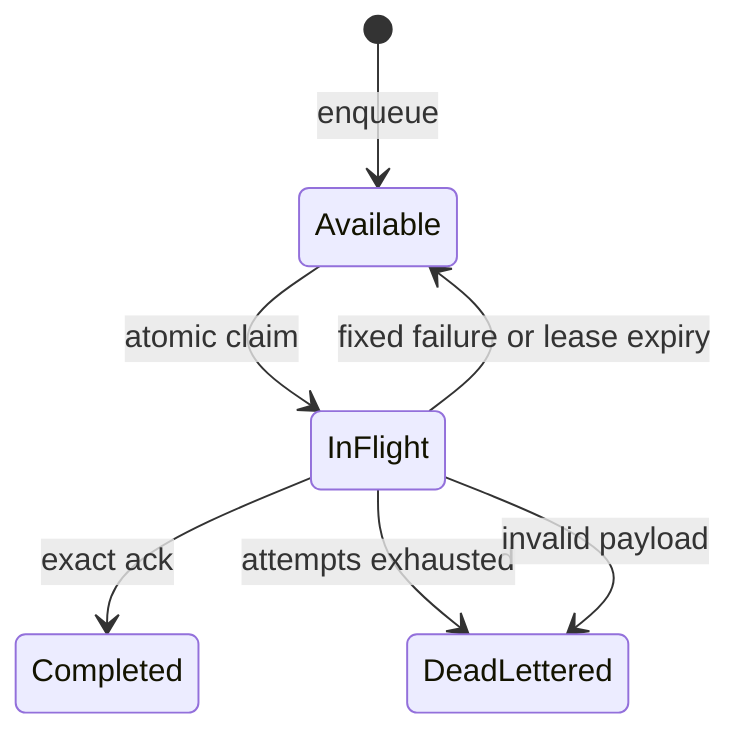

# Project Queues Alpha 3

Dieses Dokument beschreibt den ausführbaren Vertrag von `1.6.0-alpha.3`. Project
Queues sind standardmäßig deaktiviert. Im Memory-Modus bleiben sie prozesslokal;
`QKERN_RUNTIME_MODE=postgres` wählt den tenantgebundenen dauerhaften Adapter aus
Migration `0026_project_queues.sql`.

## Scope und Rollen

Jede Queue und Nachricht ist unveränderlich an Organisation, Projekt und
Environment gebunden. Queue-Verwaltung und Status benötigen eine QKERN-Session mit
Owner- oder Administrator-Rolle. App-Aufrufe benötigen den exakt passenden
Project API Key:

| Operation | Autorität |
| --- | --- |
| Queue anlegen, auflisten, Status | Owner/Administrator-Session |
| Enqueue bei `authenticated` | Public Key plus aktives Project-Auth-JWT oder Service Key |
| Enqueue bei `service` | Service Key |
| Claim, Ack, Fail, Lease-Renewal | ausschließlich Service Key |

Der Tenant wird nie aus Body, URL-Headern oder MCP-Argumenten übernommen. Ein Key
oder eine Session wird serverseitig in genau einen Scope aufgelöst. Nicht erlaubte
Ressourcen antworten ohne Existenzhinweis.

## Zustandsautomat



Eine Queue setzt feste Grenzen für maximale Versuche, Visibility Timeout,
exponentiellen Retry, Dedupe-Fenster, Completed-Retention und offene Nachrichten.
`scheduledAt` darf höchstens sieben Tage in der Zukunft liegen. Der Server und
nicht der Worker berechnet den Retry als begrenztes exponentielles Backoff.

## Idempotenz und Dedupe

`dedupeKey` ist optional, maximal 128 Zeichen lang und wird niemals roh gespeichert
oder zurückgegeben. QKERN persistiert nur einen SHA-256-Verifier. Innerhalb des
konfigurierten Fensters erzeugen parallele Enqueues mit demselben Key genau eine
Nachricht und liefern dieselbe ID; die zweite Antwort trägt `deduplicated: true`.

Nachrichten sind JSON, standardmäßig auf 64 KiB, Tiefe 12 und 4.000 Knoten
begrenzt. Prototype-Schlüssel werden abgewiesen. Antworten von Enqueue, Status und
Queue-Verwaltung geben den Payload nicht aus.

## Lease-Fencing

Ein atomarer Claim liefert höchstens zehn Nachrichten und erzeugt pro Nachricht
einen 256-Bit-Lease-Token. Der Token wird einmal ausgegeben; nur sein SHA-256-
Verifier wird gespeichert. Ack, Fail und Renewal verlangen gleichzeitig:

- exakte Queue und Nachrichten-ID;
- denselben `workerId`;
- denselben noch gültigen Lease-Token;
- eine noch nicht abgelaufene Lease.

Jeder erfolgreiche Claim erhöht `leaseSequence`. Ein abgelaufener oder alter
Worker kann nach einem Reclaim keinen Zustand mehr schreiben. Lease-Ablauf zählt
als Versuchsergebnis `LEASE_EXPIRED`; beim konfigurierten Maximum folgt Dead Letter.
Die öffentliche Statusprojektion enthält keine Payloads, Worker-IDs, Verifier oder
Tokens.

## PostgreSQL-Persistenz

Queue-Definitionen und Nachrichten besitzen zusammengesetzte Fremdschlüssel auf
Organisation, Projekt und Environment. Erzwungene RLS verwendet ausschließlich
den serverseitigen Tenant-Kontext. Die Runtime darf Definitionen anlegen und
Nachrichten über eng begrenzte Spaltenübergänge fortschreiben; Payload, Scope,
Owner und Identität sind nach dem Insert unveränderlich.

Concurrent Consumer sperren nur tatsächlich ausgewählte Nachrichten mit
`FOR UPDATE SKIP LOCKED`. Dedupe- und Lease-Tokens werden ausschließlich als
SHA-256-Verifier gespeichert. Datenbank-Constraints und Trigger erzwingen legale
Statuswechsel, monotone Claim-Generationen und sichere Completed-Retention. Ein
Neustart des Webprozesses verliert PostgreSQL-Queues und aktive Leases nicht.

## Worker und Dead Letters

`ProjectQueueWorker` ist ein injizierbarer Port für einen separaten Prozess.

Bis `1.42.0` war das ein Port **ohne Wirt**: Der Worker war gebaut und getestet,
und kein Prozesseinstieg startete ihn — Nachrichten liessen sich einreihen, und
niemand nahm sie heraus. Gefunden hat das nicht Handarbeit, sondern der
Erreichbarkeitsvertrag in `tests/entrypoint-reachability-contract.test.ts`.

`npm run worker:queues` startet den Wirt. Jede Bindung in
`QKERN_QUEUE_WORKER_BINDINGS_JSON` gibt genau eine Queue an genau eine
hinterlegte Function; Kapazität und eine fehlende Function gelten als
`DEPENDENCY_UNAVAILABLE` und damit als wiederholbar. Ein
Handler erhält genau eine bounded Message und ein AbortSignal. Der Worker claimt
höchstens eine Nachricht gleichzeitig, erneuert ihre Lease periodisch, erzwingt
einen festen Timeout und acked oder failed ausschließlich mit dem ursprünglichen
einmaligen Lease-Token. Shutdown vor Claim nimmt keine Arbeit; Shutdown während
eines Handlers bricht den Handler ab und überlässt die Nachricht der gefencten
Lease-Recovery.

Logs und Zähler enthalten Queue, Message-ID, Attempt, feste Outcomes und feste
Failure Codes, niemals Payload, Worker-ID, Dedupe-/Lease-Secret. Ein Handler kann
nur `HANDLER_ERROR`, `DEPENDENCY_UNAVAILABLE` oder `INVALID_PAYLOAD` klassifizieren;
Timeout bleibt Worker-Autorität.

Owner und Administratoren können redigierte Dead-Letter-Referenzen listen und ein
Replay anfordern. Das Replay führt nichts im HTTP-Request aus, gibt keinen Payload
zurück und erzeugt über Migration 0027 concurrent genau eine neue Nachricht mit
unveränderlicher same-tenant Quellbindung. MCP erhält keine DLQ- oder Worker-
Autorität.

## REST-Endpunkte

- `GET|POST /api/v1/projects/{projectId}/environments/{environment}/queues`
- `POST .../queues/{queue}/messages`
- `POST .../queues/{queue}/claims`
- `POST .../queues/{queue}/messages/{messageId}/ack`
- `POST .../queues/{queue}/messages/{messageId}/fail`
- `POST .../queues/{queue}/messages/{messageId}/lease`
- `GET .../queues/{queue}/status`
- `GET .../queues/{queue}/dead-letters`
- `POST .../queues/{queue}/dead-letters/{messageId}/replay`

Browser-App-Routen verwenden eine exakte CORS-Allowlist. Session-Mutationen
benötigen zusätzlich die bestehende Same-Origin-CSRF-Grenze. Cache-Control ist
`private, no-store`. Vollständige Schemas stehen im OpenAPI-3.1-Vertrag.

## MCP

Für einen fest konfigurierten MCP-Scope existieren:

- `qkern_queues_list` — read-only;
- `qkern_queue_status` — read-only;
- `qkern_queue_message_enqueue` — nicht destruktiver Write, ohne globale
  Idempotenzbehauptung; für Retry-sichere Agentenabläufe einen stabilen
  `dedupeKey` setzen.

MCP stellt absichtlich keine Claim-, Ack-, Fail-, Lease- oder Dead-Letter-
Manipulation bereit. Ein Agent erhält dadurch keine Worker-Ausführungsautorität.

## Lokal testen

In PowerShell vor `npm run dev`:

```powershell
$env:QKERN_PROJECT_QUEUES_ENABLED="true"
$env:QKERN_PROJECT_QUEUES_ALLOWED_ORIGINS="http://localhost:3000"
$env:QKERN_PROJECT_QUEUES_MAX_PAYLOAD_BYTES="65536"
```

Für den dauerhaften Pfad zusätzlich `QKERN_RUNTIME_MODE=postgres` und die
least-privilege `QKERN_RUNTIME_DATABASE_URL` aus `.env.example` setzen sowie
Migration 0026 kontrolliert anwenden. Danach Queue als Owner/Administrator über
REST anlegen und einen zum Environment passenden Project Key verwenden. Nur im
Memory-Modus geht der Zustand bei Prozessneustart verloren.

## Bewusste Alpha-Grenzen

- PostgreSQL-Adapter vorhanden, aber reale Multi-Instance-/Crash-/Load-Läufe in
  dieser Umgebung nicht ausgeführt;
- seit `1.42.0` verarbeitet `npm run worker:queues` Nachrichten wirklich; der
  Wirt kann genau eines — eine Nachricht an eine hinterlegte Function geben —
  und ein allgemeiner Handler-Host sowie ein Consumer-SDK fehlen weiter;
- redigierte Prozesszähler vorhanden, aber kein Metrics-Exporter, Tracing,
  Last-/Soak-Test oder archiviertes Real-Broker-E2E;
- keine Production-Freigabe.

`NODE_ENV=production` akzeptiert ausschließlich `QKERN_RUNTIME_MODE=postgres` oder
einen dependency-injizierten Repository-Port mit deklarierter `durable`-Semantik.
Der Memory-Adapter deklariert `ephemeral`; diese Sperre kann durch ein Enable-Flag
nicht umgangen werden. Vor einer Production-Freigabe sind archivierte
Transaktions-/Crash-Races, horizontales Fencing, Monitoring und externe
Security-/Lastnachweise erforderlich.
