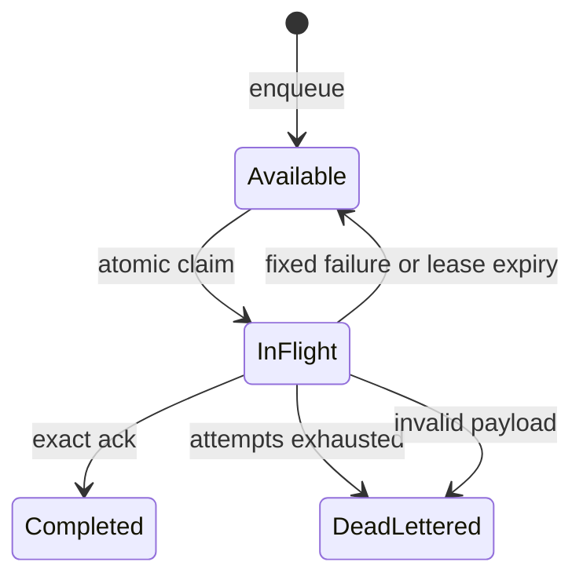

# Project Queues Alpha 3

Dieses Dokument beschreibt den ausführbaren Vertrag von `1.6.0-alpha.3`. Project
Queues sind standardmäßig deaktiviert. Im Memory-Modus bleiben sie prozesslokal;
`QKERN_RUNTIME_MODE=postgres` wählt den tenantgebundenen dauerhaften Adapter aus
Migration `0026_project_queues.sql`.

## Scope und Rollen

Jede Queue und Nachricht ist unveränderlich an Organisation, Projekt und
Environment gebunden. Queue-Verwaltung und Status benötigen eine QKERN-Session mit
Owner- oder Administrator-Rolle. App-Aufrufe benötigen den exakt passenden
Project API Key:

| Operation | Autorität |
| --- | --- |
| Queue anlegen, auflisten, Status | Owner/Administrator-Session |
| Enqueue bei `authenticated` | Public Key plus aktives Project-Auth-JWT oder Service Key |
| Enqueue bei `service` | Service Key |
| Claim, Ack, Fail, Lease-Renewal | ausschließlich Service Key |

Der Tenant wird nie aus Body, URL-Headern oder MCP-Argumenten übernommen. Ein Key
oder eine Session wird serverseitig in genau einen Scope aufgelöst. Nicht erlaubte
Ressourcen antworten ohne Existenzhinweis.

## Zustandsautomat



Eine Queue setzt feste Grenzen für maximale Versuche, Visibility Timeout,
exponentiellen Retry, Dedupe-Fenster, Completed-Retention und offene Nachrichten.
`scheduledAt` darf höchstens sieben Tage in der Zukunft liegen. Der Server und
nicht der Worker berechnet den Retry als begrenztes exponentielles Backoff.

## Idempotenz und Dedupe

`dedupeKey` ist optional, maximal 128 Zeichen lang und wird niemals roh gespeichert
oder zurückgegeben. QKERN persistiert nur einen SHA-256-Verifier. Innerhalb des
konfigurierten Fensters erzeugen parallele Enqueues mit demselben Key genau eine
Nachricht und liefern dieselbe ID; die zweite Antwort trägt `deduplicated: true`.

Nachrichten sind JSON, standardmäßig auf 64 KiB, Tiefe 12 und 4.000 Knoten
begrenzt. Prototype-Schlüssel werden abgewiesen. Antworten von Enqueue, Status und
Queue-Verwaltung geben den Payload nicht aus.

## Lease-Fencing

Ein atomarer Claim liefert höchstens zehn Nachrichten und erzeugt pro Nachricht
einen 256-Bit-Lease-Token. Der Token wird einmal ausgegeben; nur sein SHA-256-
Verifier wird gespeichert. Ack, Fail und Renewal verlangen gleichzeitig:

- exakte Queue und Nachrichten-ID;
- denselben `workerId`;
- denselben noch gültigen Lease-Token;
- eine noch nicht abgelaufene Lease.

Jeder erfolgreiche Claim erhöht `leaseSequence`. Ein abgelaufener oder alter
Worker kann nach einem Reclaim keinen Zustand mehr schreiben. Lease-Ablauf zählt
als Versuchsergebnis `LEASE_EXPIRED`; beim konfigurierten Maximum folgt Dead Letter.
Die öffentliche Statusprojektion enthält keine Payloads, Worker-IDs, Verifier oder
Tokens.

## PostgreSQL-Persistenz

Queue-Definitionen und Nachrichten besitzen zusammengesetzte Fremdschlüssel auf
Organisation, Projekt und Environment. Erzwungene RLS verwendet ausschließlich
den serverseitigen Tenant-Kontext. Die Runtime darf Definitionen anlegen und
Nachrichten über eng begrenzte Spaltenübergänge fortschreiben; Payload, Scope,
Owner und Identität sind nach dem Insert unveränderlich.

Concurrent Consumer sperren nur tatsächlich ausgewählte Nachrichten mit
`FOR UPDATE SKIP LOCKED`. Dedupe- und Lease-Tokens werden ausschließlich als
SHA-256-Verifier gespeichert. Datenbank-Constraints und Trigger erzwingen legale
Statuswechsel, monotone Claim-Generationen und sichere Completed-Retention. Ein
Neustart des Webprozesses verliert PostgreSQL-Queues und aktive Leases nicht.

## Worker und Dead Letters

`ProjectQueueWorker` ist ein injizierbarer Port für einen separaten Prozess.

Bis `1.42.0` war das ein Port **ohne Wirt**: Der Worker war gebaut und getestet,
und kein Prozesseinstieg startete ihn — Nachrichten liessen sich einreihen, und
niemand nahm sie heraus. Gefunden hat das nicht Handarbeit, sondern der
Erreichbarkeitsvertrag in `tests/entrypoint-reachability-contract.test.ts`.

`npm run worker:queues` startet den Wirt. Jede Bindung in
`QKERN_QUEUE_WORKER_BINDINGS_JSON` gibt genau eine Queue an genau eine
hinterlegte Function; Kapazität und eine fehlende Function gelten als
`DEPENDENCY_UNAVAILABLE` und damit als wiederholbar. Ein
Handler erhält genau eine bounded Message und ein AbortSignal. Der Worker claimt
höchstens eine Nachricht gleichzeitig, erneuert ihre Lease periodisch, erzwingt
einen festen Timeout und acked oder failed ausschließlich mit dem ursprünglichen
einmaligen Lease-Token. Shutdown vor Claim nimmt keine Arbeit; Shutdown während
eines Handlers bricht den Handler ab und überlässt die Nachricht der gefencten
Lease-Recovery.

Logs und Zähler enthalten Queue, Message-ID, Attempt, feste Outcomes und feste
Failure Codes, niemals Payload, Worker-ID, Dedupe-/Lease-Secret. Ein Handler kann
nur `HANDLER_ERROR`, `DEPENDENCY_UNAVAILABLE` oder `INVALID_PAYLOAD` klassifizieren;
Timeout bleibt Worker-Autorität.

Owner und Administratoren können redigierte Dead-Letter-Referenzen listen und ein
Replay anfordern. Das Replay führt nichts im HTTP-Request aus, gibt keinen Payload
zurück und erzeugt über Migration 0027 concurrent genau eine neue Nachricht mit
unveränderlicher same-tenant Quellbindung. MCP erhält keine DLQ- oder Worker-
Autorität.

## REST-Endpunkte

- `GET|POST /api/v1/projects/{projectId}/environments/{environment}/queues`
- `POST .../queues/{queue}/messages`
- `POST .../queues/{queue}/claims`
- `POST .../queues/{queue}/messages/{messageId}/ack`
- `POST .../queues/{queue}/messages/{messageId}/fail`
- `POST .../queues/{queue}/messages/{messageId}/lease`
- `GET .../queues/{queue}/status`
- `GET .../queues/{queue}/dead-letters`
- `POST .../queues/{queue}/dead-letters/{messageId}/replay`
- `GET .../queues/{queue}/messages/{messageId}/trace`
- `GET .../queues/{queue}/messages/{messageId}/own-trace` (Projekt-Key, seit `2.131`)
- `GET .../environments/{environment}/queue-traces?traceId=` (seit `2.131`)

Browser-App-Routen verwenden eine exakte CORS-Allowlist. Session-Mutationen
benötigen zusätzlich die bestehende Same-Origin-CSRF-Grenze. Cache-Control ist
`private, no-store`. Vollständige Schemas stehen im OpenAPI-3.1-Vertrag.

## MCP

Für einen fest konfigurierten MCP-Scope existieren:

- `qkern_queues_list` — read-only;
- `qkern_queue_status` — read-only;
- `qkern_queue_message_trace` — read-only; die Spur **einer** Nachricht, über
  OAuth als der zustimmende Nutzer und nur für dessen eigene Nachrichten, ohne
  Wirt und ohne Nutzlast. Die Suche nach einer Spur-Id gibt es hier nicht;
- `qkern_queue_message_enqueue` — nicht destruktiver Write, ohne globale
  Idempotenzbehauptung; für Retry-sichere Agentenabläufe einen stabilen
  `dedupeKey` setzen.

MCP stellt absichtlich keine Claim-, Ack-, Fail-, Lease- oder Dead-Letter-
Manipulation bereit. Ein Agent erhält dadurch keine Worker-Ausführungsautorität.

## Lokal testen

In PowerShell vor `npm run dev`:

```powershell
$env:QKERN_PROJECT_QUEUES_ENABLED="true"
$env:QKERN_PROJECT_QUEUES_ALLOWED_ORIGINS="http://localhost:3000"
$env:QKERN_PROJECT_QUEUES_MAX_PAYLOAD_BYTES="65536"
```

Für den dauerhaften Pfad zusätzlich `QKERN_RUNTIME_MODE=postgres` und die
least-privilege `QKERN_RUNTIME_DATABASE_URL` aus `.env.example` setzen sowie
Migration 0026 kontrolliert anwenden. Danach Queue als Owner/Administrator über
REST anlegen und einen zum Environment passenden Project Key verwenden. Nur im
Memory-Modus geht der Zustand bei Prozessneustart verloren.

## Die Spur einer Nachricht

Seit (2.121) trägt jede Nachricht ein Protokoll ihrer Stationen. Migration
`0081_project_queue_message_traces.sql` legt die Tabelle an, und jede Zeile
entsteht **in derselben Transaktion** wie der Zustandswechsel, den sie
beschreibt. Es gibt damit keine Station ohne ihren Zustandswechsel und keinen
Zustandswechsel ohne seine Station, und beides übersteht einen Neustart des
Wirts und zwei Instanzen.

Gelesen wird je Nachricht, als Owner oder Administrator:

```
GET /api/v1/projects/{projectId}/environments/{environment}/queues/{queue}/messages/{messageId}/trace
```

Seit `2.131` liest auch eine **Anwendung** die Spur ihrer eigenen Nachricht,
mit Projekt-Key und ohne den Wirt:

```
GET /api/v1/projects/{projectId}/environments/{environment}/queues/{queue}/messages/{messageId}/own-trace
```

Und eine fremde Spur-Id lässt sich suchen, über alle Queues **einer**
Umgebung, Admin-only und mit Keyset-Cursor:

```
GET /api/v1/projects/{projectId}/environments/{environment}/queue-traces?traceId=<32 Hex>&limit=50&cursor=<messageId>
```

Acht Stationen, je mit Zeitpunkt, Versuch und, wo es einen gibt, Wirt und
festem Fehlercode:

| Station | entsteht | Wirt | Grund |
| --- | --- | --- | --- |
| `enqueued` | Einstellen einer neuen Nachricht | nein | nein |
| `deduplicated` | Einstellen trifft einen gültigen Zwilling | nein | nein |
| `replayed` | Wiedereinreihen eines Dead Letters | nein | nein |
| `claimed` | ein Worker bekommt die Pacht | ja | nein |
| `completed` | Ack | ja | nein |
| `retry_scheduled` | Fail, Nachricht kommt zurück | ja | ja |
| `dead_lettered` | Fail ohne Versuch mehr, oder verfallene Pacht ohne | ja | ja |
| `lease_expired` | verfallene Pacht gibt die Nachricht frei | ja | `LEASE_EXPIRED` |

**Zusammengehalten wird eine Spur von der Nachrichten-Id.** Das ist keine neue
Kennung: Sie steht in der Quittung des Einreihens, kommt im Claim zurück,
benennt Ack, Fail und Lease und steht in der Dead-Letter-Liste.

**W3C Trace Context ist der Anschluss nach draussen.** Das Einreihen liest eine
Kopfzeile `traceparent`; ihre Spur-Id und Eltern-Span landen auf der ersten
Station und stehen am Kopf jeder Antwort. Kein Claim, kein Retry und kein Dead
Letter entscheidet etwas an diesen beiden Werten, und ein Kopf, der nicht zur
Form passt, wird weggelassen statt abgewiesen: Ein Beobachtungskopf darf ein
Einreihen nicht umbringen. Eine wiedereingereihte Nachricht erbt den Anschluss
ihrer Quelle, damit eine Kette durch ein Dead Letter draussen **eine** Spur
bleibt.

**Und der Anschluss laeuft wieder hinaus (2.124, 2.125, Migration 0082).** Bis
`2.72.0` hoerte eine Spur an der QKERN-Grenze auf, obwohl sie draussen anfing
und draussen weiterging. Jetzt gilt:

- **Jede Station hat ihre eigene Span-Id** (`span_id`), von QKERN erzeugt beim
  Schreiben der Station und in der Datenbank gespeichert. Nicht abgeleitet aus
  `message_id` und `sequence`: Die Nachrichten-Id gibt QKERN dem Aufrufer heraus,
  eine abgeleitete Span liesse sich also nachrechnen, und eine Sequenznummer kann
  nach dem Aufräumen ein zweites Mal vorkommen. Die Spalte steht in jeder
  Antwort der Trace-Route.
- **Der Claim liefert einen `traceparent` mit.** Spur-Id der Nachricht,
  Eltern-Span die `claimed`-Station dieses Claims. Nicht der Span des
  Einreichers: Was der Worker jetzt tut, hängt an der Abholung, und zwischen
  beiden liegt im Zweifel eine Woche.
- **Ohne Anschluss bleibt der Claim leer.** QKERN erfindet keine Spur-Id. Eine
  erfundene wäre draussen eine Spur mit einem Teilnehmer, und in der Antwort der
  Trace-Route wäre sie von einem echten Anschluss nicht zu unterscheiden.
- **Die Flags stehen immer auf `01`.** Nach W3C beschreiben sie die Span, die im
  Kopf steht, und das ist eine Station von QKERN; die ist immer aufgezeichnet.
  Der Preis: Wer draussen `00` setzt, um eine Spur gar nicht aufzuzeichnen,
  bekommt sie hinter QKERN wieder eingeschaltet.
- **`tracestate` geht nicht mit.** QKERN ist kein Tracing-Anbieter und hätte
  nichts hineinzuschreiben; was bliebe, wäre ein durchkopierter Blob auf einer
  Logfläche, und genau das verbietet die Regel „kein Inhalt" eine Zeile weiter
  unten.
- **Ein Dead-Letter-Replay erbt den Anschluss unverändert**, Eltern-Span
  inklusive. Der erste Entwurf von 2.124 liess ihn an der letzten Station der
  Quelle hängen, weil das Wiedereinreihen ja vom Dead Letter verursacht wird;
  Fall (2.121) hat ihn umgeworfen, und zwar zu Recht. `parent_span_id` heisst
  „die Span **draussen**, an der diese Nachricht hängt", und eine Spalte mit zwei
  Bedeutungen läuft auseinander. Die Ursache steht genauer in
  `source_message_id`. Für die Span-Kette heisst das: QKERN gibt genau **eine**
  Kante heraus, die vom Claim zum Worker; zwei Claims derselben Spur vor und nach
  einem Dead Letter teilen dieselbe Eltern-Span von draussen, und das ist
  richtig, weil beide auf denselben Aufruf zurückgehen.
- **Eine ausgehende Webhook-Zustellung trägt ihn als Kopfzeile `traceparent`.**
  Der Anschluss steht in `project_webhook_deliveries` und ist dort so
  unveränderlich wie die Nutzlast, damit ein zweiter Versuch nicht eine andere
  Spur nennt als der erste. Er wird **nicht** signiert: Ein Proxy, der
  Tracing-Köpfe anfasst, würde sonst die Signatur brechen und ein echtes
  Ereignis bekäme 401.

Keiner der ausgelieferten Sammler setzt diesen Anschluss heute: Change Feed,
Audit-Kette und Log-Protokoll tragen selbst keinen `traceparent`. Der Weg ist
da, der Erzeuger fehlt noch.

**Kein Inhalt.** Die Tabelle hat keine Spalte für eine Nutzlast, für einen
Dedupe-Verifikator, für ein Lease-Token oder für eine Fehlermeldung. Was bleibt,
sind Zeitpunkte, feste Codes, die Wirt-Kennung und Zähler.

**Grenzen.** 64 Stationen je Nachricht, durchgesetzt in der Anweisung, die
schreibt. Die Rechnung: zwanzig Versuche mal zwei Stationen plus die erste sind
41, und die einzige Station, die ein Aufrufer beliebig oft erzeugen kann, ist
`deduplicated`. An der Grenze schreibt der Port nichts mehr und wirft nicht; der
Leser sagt dann `complete: false`.

**Aufbewahrung.** Jede Zeile trägt ihr eigenes `expires_at`, und geschnitten
wird dort und **nie** am Ausgang der Nachricht: Eine Fehlersuche fängt nach dem
Ausgang an, nicht davor. Die Frist ist
`max(retention_seconds der Queue, ein Betriebstag)` — nie kürzer als die
Aufbewahrung der Nachricht, denn eine Nachricht ohne Spur sieht aus wie eine,
für die nie Stationen geschrieben wurden, und mindestens einen Betriebstag, denn
nach dem Aufräumen der Nachricht ist die Spur das Einzige, was von ihr übrig
ist. Aufgeräumt wird im vorhandenen `cleanup()` je Queue, also beim Einreihen
und beim Status, häppchenweise mit fester Obergrenze. Die Spur hat deshalb
**keinen** Fremdschlüssel auf die Nachricht: Eine Kaskade nähme sie genau dann
weg, wenn sie am meisten wert ist.

## Eine Spur suchen, und wer was davon sieht

Seit `2.131` ist eine Spur auffindbar und nicht nur nachschlagbar. Vorher ging
Lesen nur je Nachricht: Wer die Id hatte, bekam die Spur; wer die Spur-Id aus
seinem Collector hatte, bekam nichts. Das war tragbar, solange die Spur-Id nur
hereinkam — seit (2.124) gibt QKERN sie wieder heraus und steht damit in
fremden Spuren drin.

**Der Index.** Migration `0085_project_queue_trace_search.sql` legt genau einen
Teilindex: `(organization_id, project_id, environment, trace_id, occurred_at,
message_id) WHERE trace_id IS NOT NULL`. Der Scope steht vorn, damit die
Mandantengrenze im Index steht und nicht erst in der Policy; eine Spur-Id
entsteht in einem fremden Dienst, und zwei Organisationen hinter demselben
Gateway tragen dieselbe. `queue_id` steht nicht drin, denn eine Spur gehört
keiner Queue. Teilindex, weil der Anschluss nur auf Sequenz eins liegt — damit
liefert die Suche je Nachricht höchstens eine Zeile, ohne `DISTINCT`.

**Die Seitenform** ist die vorhandene: Keyset wie am Audit-Log von Project
Auth. Der Cursor ist die Nachrichten-Id der letzten Zeile, ihre Position liest
die Abfrage selbst nach, und ein Cursor, dessen Zeile weggeräumt ist, liefert
eine leere Seite statt der ersten. Geordnet wird aufsteigend, denn eine Spur
liest man vorwärts. Eine Gesamtzahl gibt es nicht: Sie wäre ein zweiter Scan
und im Augenblick der Antwort veraltet.

**Eine Zeile je Nachricht**, nicht je Station: Die Stationen haben ihre eigene
Tür. Die Zeile nennt Queue, erste Station (`enqueued` oder `replayed`),
Span-Id, den Eltern-Span des Aufrufers und bei einem Replay das Dead Letter.
Keinen Wirt — die erste Station hat per CHECK keinen.

**Nie über Umgebungen oder Organisationen hinaus.** `traceId` ist das Einzige,
was ein Aufrufer zur Auswahl beiträgt; Projekt und Umgebung kommen aus dem
Pfad, die Organisation aus der Sitzung, und darunter liegt die
Zeilensicherheit aus 0081.

**Was eine Anwendung sehen darf.** Die Nachrichten-Id ist die halbe Bedingung:
Sie ist in der Quittung herausgegeben, also ein Beweis für den, der sie hat,
und derselbe für jeden, der sie mitgelesen hat. Die andere Hälfte ist
`owner_subject` an der Nachricht. Ein `authenticated` Projekt-Key sieht nur
seine eigene Nachricht, ein `service_role` Key jede dieser Umgebung (mit
demselben Key holt er sie samt Nutzlast ab), ein `anon` Key keine. Der Wirt
fehlt dabei, und nicht als `null`: Er ist ein Betriebsdetail, und die
Anwendungsform der Spur hat das Feld gar nicht. Der Preis: Ist die Nachricht
weggeräumt, gibt es keinen Besitzer zum Vergleichen, und ein Endnutzer bekommt
nichts mehr; der Betreiber behält das ganze Fenster. Die Suche bleibt beim
Betreiber, denn sie nennt Nachrichten verschiedener Besitzer.

**Was absichtlich fehlt**: eine Station für die Erneuerung der Pacht (ein
Herzschlag alle zehn Sekunden protokolliert den Takt und nicht die Arbeit; ob
eine Pacht gehalten hat, sagt der Ausgang).
Dazu, offen und nicht absichtlich: QKERN exportiert keine Spans an einen
Collector, innerhalb einer Spur gibt es keine Span-Kanten (die Ordnung ist
`sequence`), der Function-Aufruf aus der Queue trägt den `traceparent`
nicht, weil er über einen Sandbox-Port geht und nicht über HTTP, es gibt keine
Suche nach einer **Span**-Id (der UNIQUE aus 0082 führt `message_id` vor
`span_id`), und die Trefferzeile der Suche nennt die erste Station und nicht
den Ausgang.

## Bewusste Alpha-Grenzen

- PostgreSQL-Adapter vorhanden, aber reale Multi-Instance-/Crash-/Load-Läufe in
  dieser Umgebung nicht ausgeführt;
- seit `1.42.0` verarbeitet `npm run worker:queues` Nachrichten wirklich; der
  Wirt kann genau eines — eine Nachricht an eine hinterlegte Function geben —
  und ein allgemeiner Handler-Host sowie ein Consumer-SDK fehlen weiter;
- redigierte Prozesszähler vorhanden; seit `1.88.0` ein Metrics-Export je Scope
  (`GET queues/metrics`, Prometheus-Textformat); seit (2.121) eine Spur je
  Nachricht und seit (2.131) eine Suche nach ihrer Spur-Id (siehe unten); kein Last-/Soak-Test und kein archiviertes
  Real-Broker-E2E;
- keine Production-Freigabe.

`NODE_ENV=production` akzeptiert ausschließlich `QKERN_RUNTIME_MODE=postgres` oder
einen dependency-injizierten Repository-Port mit deklarierter `durable`-Semantik.
Der Memory-Adapter deklariert `ephemeral`; diese Sperre kann durch ein Enable-Flag
nicht umgangen werden. Vor einer Production-Freigabe sind archivierte
Transaktions-/Crash-Races, horizontales Fencing, Monitoring und externe
Security-/Lastnachweise erforderlich.
